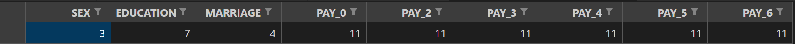

### How to run

`python train.py -config config.yml`

The following is an example of the `config.yml` file where all the arguments related to training and testing are set:

```
    patience: 50 # For early stopping. How many epochs to wait.
    epochs: 100 # number of epochs
    b_sz: 256 # batch size
    is_valid : 1
    report_test: 0
    train_path: <path_to_train>
    valid_path: <path_to_valid>
    test_path: <path_to_train>
    n_classes: 2 # number of classes
    ckpt_path: None # if you want to load the model from a specific checkpoint, supply the path to the checkpoint file
    num_features: /home/vineeth/Documents/GitWorkSpace/PytorchRecipes/SimpleMLP/Dataset/bank/numerical_clms.csv # a csv file containing the required features
    cat_features: /home/vineeth/Documents/GitWorkSpace/PytorchRecipes/SimpleMLP/Dataset/bank/categorical_clms.csv # a csv file containing the required features
    # label_clm: default.payment.next.month
    label_clm: y
    model_storage_path: trained_weights
```

The user has to provide a list of numerical and categorical columns (categorical columns are otpional). 


To prepare the data in a specific format, run `PrepareData.ipynb`.

### Categorical Columns

